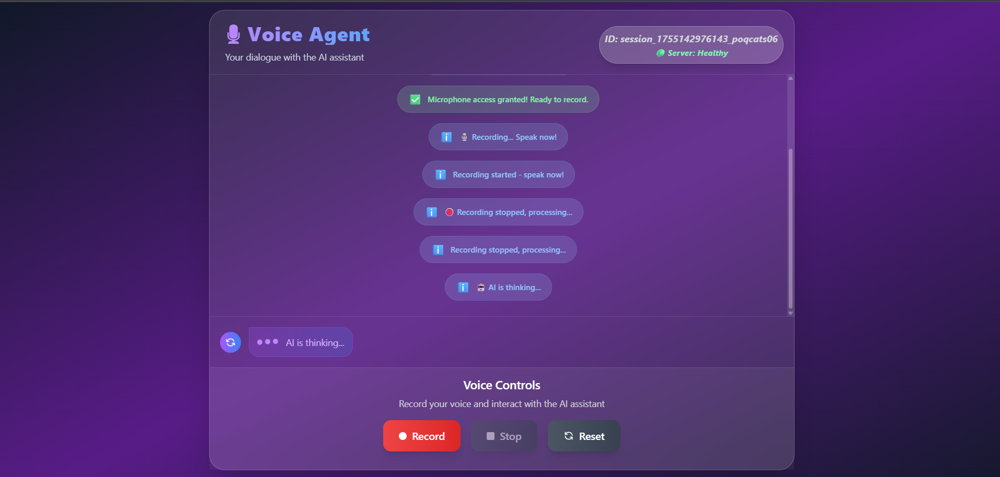
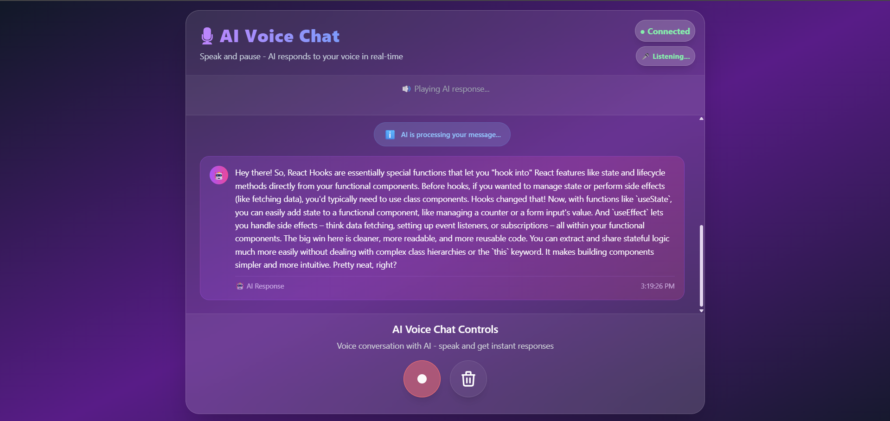

# 🎙️ Voice Agent - AI-Powered Voice Assistant

A real-time voice interaction platform built with FastAPI that enables natural conversations with AI through speech-to-text and text-to-speech technologies.


## Screenshots

_Main Interface_


_AI Conversation_



_Reset_


## 🌟 Core Features

-   **🎤 Real-time Voice Recording** - Browser-based audio capture with visual feedback
-   **🤖 AI Conversations** - Intelligent responses using Google Gemini AI
-   **🔊 Natural Voice Synthesis** - High-quality text-to-speech with Murf AI
-   **📝 Accurate Transcription** - Speech-to-text conversion via AssemblyAI
-   **💬 Live Chat Interface** - Real-time conversation display with message history
-   **🔄 Session Management** - Persistent conversations with unique session IDs
-   **📱 Responsive Design** - Works seamlessly on desktop and mobile devices

## 🛠️ Technologies

### Backend

-   **FastAPI** - Modern Python web framework for building APIs
-   **Uvicorn** - ASGI server for production-ready deployment
-   **Python 3.12+** - Core programming language
-   **Pydantic** - Data validation using Python type hints

### AI & Audio Services

-   **Google Gemini AI** - Advanced language model for intelligent responses
-   **Murf AI** - Professional text-to-speech synthesis
-   **AssemblyAI** - High-accuracy speech-to-text transcription

### Frontend

-   **Tailwind CSS** - Modern utility-first CSS framework
-   **Vanilla JavaScript** - WebAudio API integration for recording

## Architecture

```
┌─────────────┐    ┌──────────────┐    ┌─────────────────┐
│   Browser   │────│   FastAPI    │────│   AI Services   │
│  (WebAudio) │    │   Backend    │    │   (STT/LLM/TTS) │
└─────────────┘    └──────────────┘    └─────────────────┘
       │                   │                      │
       ▼                   ▼                      ▼
   Audio Input  ────→  Processing  ────→   Audio Output
```

**Workflow:**

1. **Record** → User records voice through browser
2. **Upload** → Audio sent to FastAPI backend
3. **Transcribe** → AssemblyAI converts speech to text
4. **Process** → Gemini AI generates intelligent response
5. **Synthesize** → Murf AI converts response to speech
6. **Playback** → Audio response played in browser

## Quick Start

### Prerequisites

-   Python 3.12 or higher
-   Valid API keys for Gemini, Murf, and AssemblyAI

### Installation

```bash
# Clone the repository
git clone https://github.com/HsAhRaSrHmIaT/FastAPI.git
cd FastAPI

# Install dependencies
pip install fastapi uvicorn python-multipart requests python-dotenv
```

### Environment Setup

Create a `.env` file in the root directory:

```env
GEMINI_API_KEY=your_gemini_api_key_here
MURF_API_KEY=your_murf_api_key_here
MURF_API_URL=your_murf_api_url_here
ASSEMBLYAI_API_KEY=your_assemblyai_api_key_here
```

### Run the Application

```bash
# Development server
uvicorn run:app --reload --host 0.0.0.0 --port 8000

# Or use the run script
python start_server.py
```

Visit `http://localhost:8000` to start using the Voice Agent!

## Project Structure

```
FastAPI/
├── run.py                 # FastAPI application entry point
├── start_server.py        # Development server launcher
├── .env                   # Environment variables (create this)
├── templates/
│   └── index.html         # Main web interface
├── static/
│   ├── script.js          # Frontend JavaScript logic
│   └── styles.css         # Additional CSS styles
├── screenshots/           # Application screenshots
└── requirements.txt       # Python package dependencies
```


## Key Components

### Voice Recording

-   WebAudio API integration for high-quality recording
-   Real-time visual feedback during recording
-   Automatic audio format handling

### AI Processing

-   Asynchronous processing pipeline
-   Context-aware conversation management
-   Error handling and retry mechanisms

### User Interface

-   Modern gradient design with smooth animations
-   Responsive layout for all device sizes
-   Real-time status indicators and typing animations

## Contributing

1. Fork the repository
2. Create a feature branch: `git checkout -b feature/amazing-feature`
3. Make your changes and test thoroughly
4. Commit: `git commit -m 'Add amazing feature'`
5. Push: `git push origin feature/amazing-feature`
6. Open a Pull Request


**Built with ❤️ using FastAPI, Murf AI, and Assembly AI**
