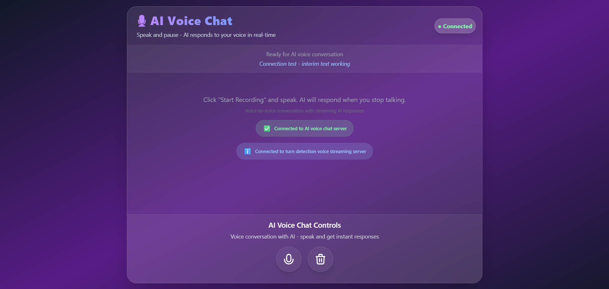
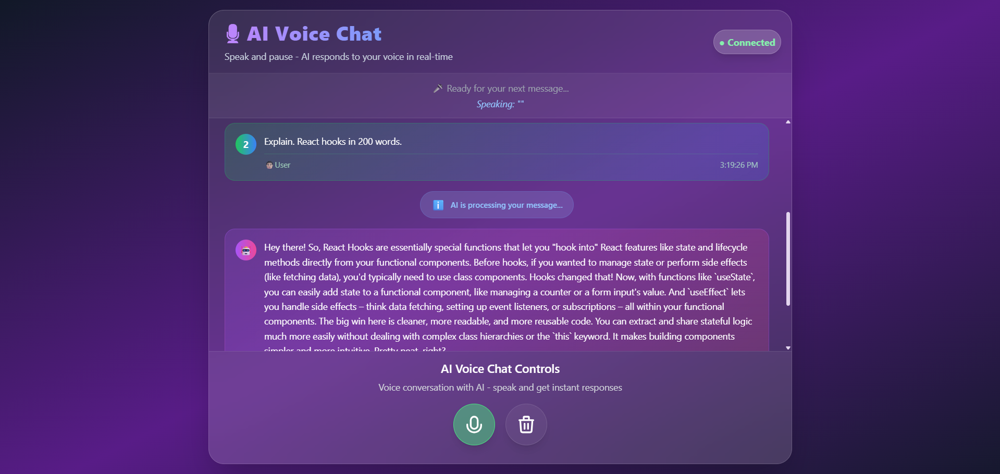
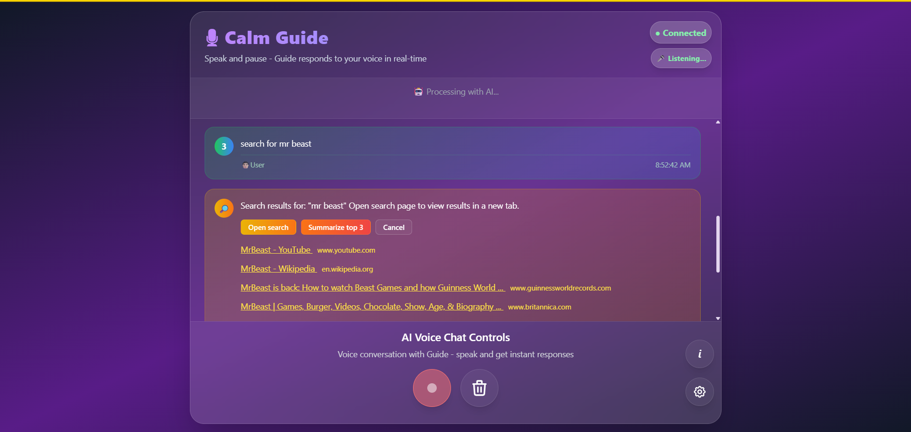
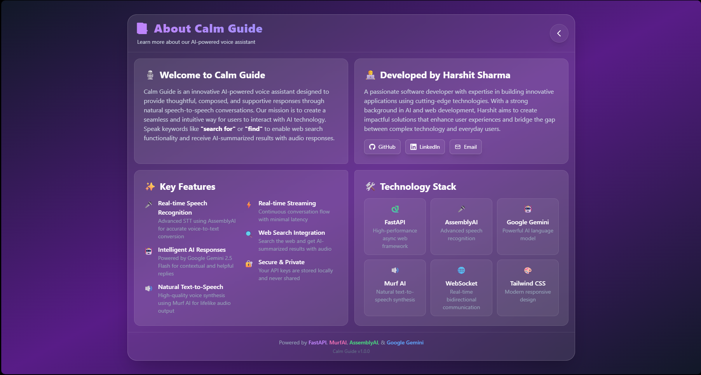
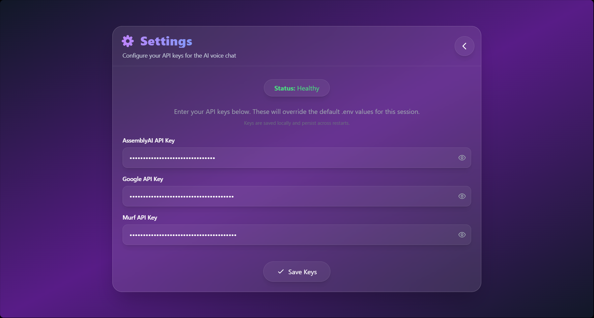
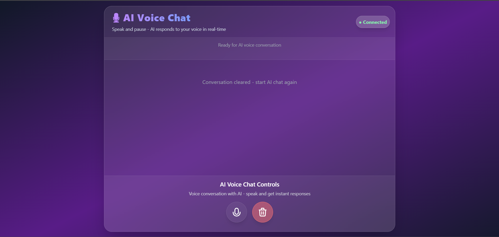
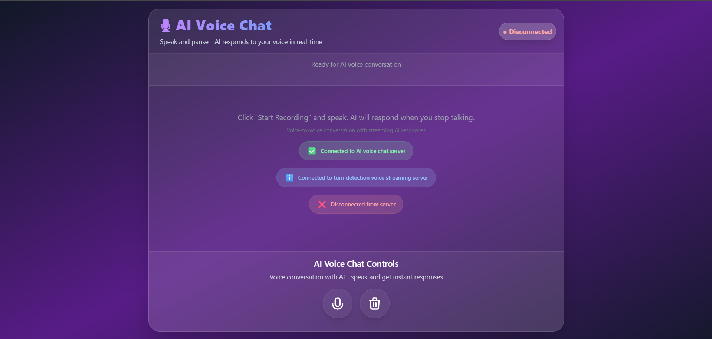

# 🧑‍💼 Meet Calm Guide: Your AI Assistant

**Calm Guide** is the AI persona powering this app. Designed to be friendly, calm, supportive, and concise, Calm Guide provides thoughtful responses and maintains a composed tone in every interaction. Calm Guide is developed by Harshit Sharma and is always here to help you as best as possible.


## 📸 Screenshots

_Main Interface_


_AI Conversation_



_About_


_Settings_


_Reset_


_Disconnect_


## 🌟 Core Features

### Real-Time Speech-to-Speech Pipeline (WebSocket)

-   **🎤 Live Voice Input** — Real-time browser audio capture (WebAudio API)
-   **🔗 WebSocket Streaming** — Instant, low-latency audio streaming to backend
-   **📝 Speech-to-Text** — High-accuracy, streaming transcription (AssemblyAI)
-   **🤖 AI Processing** — Google Gemini LLM for intelligent, contextual responses
-   **🌐 Web Search** — Built-in DuckDuckGo search for up-to-date answers
-   **🔊 Text-to-Speech** — Natural, streaming voice synthesis (Murf AI)
-   **🎧 Audio Output** — Seamless, real-time playback in browser

### Advanced Capabilities

-   **💬 Conversational Memory** — Maintains context across turns
-   **📱 Responsive UI** — Works on desktop and mobile
-   **🔄 Session Management** — Persistent, isolated conversations
-   **⚡ True Real-Time** — WebSocket pipeline for instant feedback
-   **🛡️ Robust Error Handling** — Graceful fallback and health checks

## 🏗️ Modern Architecture

### Real-Time Streaming Pipeline

```
┌─────────────┐    ┌────────────────────┐    ┌─────────────────┐
│   Browser   │<──>│   FastAPI Backend  │<──>│   AI Services   │
│  (WebAudio) │    │ (WebSocket/REST)   │    │ (STT/LLM/TTS)   │
└─────────────┘    └────────────────────┘    └─────────────────┘
       │                     │                        │
       ▼                     ▼                        ▼
   Audio Input  ⇄  Real-Time Processing  ⇄  Audio/Text Output
```

### Workflow

1. **🎤 Capture** — User records voice in browser
2. **� Stream** — Audio streamed via WebSocket to backend
3. **📝 Transcribe** — AssemblyAI provides live transcription
4. **🌐 Web Search** — (Optional) AI can trigger web search for up-to-date info
5. **🤖 Respond** — Gemini LLM generates contextual reply
6. **🔊 Synthesize** — Murf AI streams natural speech back
7. **🎧 Playback** — Audio streamed to browser for instant feedback

## 🛠️ Technology Stack

### Backend

-   **FastAPI** — Modern async Python web framework
-   **Uvicorn** — ASGI server
-   **Python 3.12+**
-   **Pydantic** — Data validation
-   **WebSocket** — Real-time streaming

### AI & Audio Services

-   **AssemblyAI** — Streaming speech-to-text
-   **Google Gemini** — LLM for conversation and search
-   **DuckDuckGo** — Web search integration
-   **Murf AI** — Streaming text-to-speech

### Frontend

-   **Vanilla JavaScript** — WebAudio API, WebSocket
-   **Tailwind CSS** — Responsive, modern UI

## 📁 Project Structure

```
📁FastAPI/
├──📄main.py                       # FastAPI app entry, WebSocket/REST routes
├──📄websocket_handler.py          # WebSocket handler for real-time pipeline
├──📁app/
│   ├──📁api/
│   │   ├──📄health.py             # Health check endpoints
│   │   └──📄search.py             # Web search endpoints
│   ├──📁core/
│   │   ├──📄config.py             # Settings, API key management
│   │   └──📄logging.py            # (Optional) Logging config
│   ├──📁models/
│   │   └──📄schemas.py            # Pydantic models
│   └──📁services/
│       ├──📄stt_service.py        # Streaming STT (AssemblyAI)
│       ├──📄llm_service.py        # LLM (Gemini) with context & search
│       ├──📄tts_service.py        # Streaming TTS (Murf AI)
│       └──📄health_service.py     # Health monitoring
├──📁static/
│   ├──📄script.js                 # Main app JavaScript
│   ├──📄styles.css                # Global styles
│   └──📄settings.js               # API key configuration
├──📁templates/
│   ├──📄index.html                # Main HTML template
│   ├──📄about.html                # About page template
│   └──📄settings.html             # Settings page template
└──📄requirements.txt              # Python dependencies
```

## 🚀 Quick Start

### Prerequisites

-   Python 3.12 or higher
-   API keys for AssemblyAI, Google Gemini, Murf AI

### Installation

```bash
git clone https://github.com/HsAhRaSrHmIaT/FastAPI-Murf.git
cd FastAPI
pip install -r requirements.txt
```

### Environment Setup

Create a `.env` file in the root directory:

```env
GOOGLE_API_KEY=your_gemini_api_key_here
MURF_API_KEY=your_murf_api_key_here
WS_MURF_URL=your_murf_websocket_url_here
ASSEMBLYAI_API_KEY=your_assemblyai_api_key_here
```

### Run the Application


```bash
# Start with Uvicorn
uvicorn main:app --reload --host 0.0.0.0 --port 8000 or
python main.py
```

Visit [http://localhost:8000](http://localhost:8000) to start your voice conversations!

## 🔧 API & WebSocket Endpoints

### WebSocket

| Endpoint | Description                       |
| -------- | --------------------------------- |
| `/ws`    | Real-time voice chat (audio/text) |

### REST API

| Endpoint                 | Method | Description             |
| ------------------------ | ------ | ----------------------- |
| `/`                      | GET    | Main web interface      |
| `/health/`               | GET    | System health status    |
| `/api/search/duckduckgo` | GET    | Web search (DuckDuckGo) |
| `/settings`              | GET    | API key management UI   |
| `/about`                 | GET    | About page              |

### Docs

| `/docs` | GET | Interactive API documentation |

## 🎯 Feature Highlights

### Conversation Intelligence

-   **Context Awareness** — Maintains conversation history for natural flow
-   **Web Search** — AI can fetch up-to-date info from the web
-   **Session Isolation** — Multiple users, independent conversations

### Audio Processing

-   **Streaming STT/TTS** — Real-time, low-latency audio pipeline
-   **High-Quality Recording** — WebAudio API, noise suppression
-   **Multiple Formats** — Supports WAV, MP3, WebM, OGG, MP4

### User Experience

-   **Real-time Feedback** — Visual indicators for recording, processing, playback
-   **Responsive Design** — Works on all devices
-   **Accessibility** — Keyboard navigation, screen reader support

## 🧩 Service Overview

### WebSocket Handler (`websocket_handler.py`)

-   Real-time, bidirectional audio/text streaming
-   Handles turn detection, session management

### STT Service (`stt_service.py`)

-   Streaming transcription (AssemblyAI)
-   Real-time, multi-format audio support

### LLM Service (`llm_service.py`)

-   Google Gemini LLM, context memory
-   Web search integration

### TTS Service (`tts_service.py`)

-   Streaming TTS (Murf AI)
-   Natural, low-latency voice output

### Health Service (`health_service.py`)

-   Monitors all external service availability
-   Provides health status for UI and API

## 🤝 Contributing

1. Fork the repository
2. Create a feature branch: `git checkout -b feature/amazing-feature`
3. Make your changes with proper testing
4. Commit: `git commit -m 'Add amazing feature'`
5. Push: `git push origin feature/amazing-feature`
6. Open a Pull Request

---

**Built with modern AI, real-time streaming, and web search for seamless voice interaction.**

_Production Ready & Actively Maintained_ 🚀
